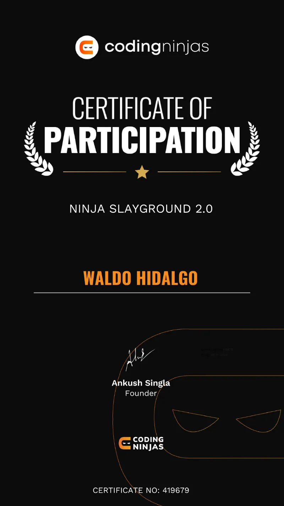

# 21-Day Coding Challenge: Ninja Slayground 2.0

Repositorio con el código solución a los desafíos diarios.

## Tabla de Contenido

- [21-Day Coding Challenge: Ninja Slayground 2.0](#21-day-coding-challenge-ninja-slayground-20)
  - [Tabla de Contenido](#tabla-de-contenido)
  - [Certificados Obtenidos](#certificados-obtenidos)
    - [Certificado Participación](#certificado-participación)
    - [Certificado Level 1: 7 days Streak](#certificado-level-1-7-days-streak)
    - [Certificado Level 2: 14 days Streak](#certificado-level-2-14-days-streak)
  - [Ejercicios Resueltos](#ejercicios-resueltos)
    - [Day 1: Switch Case statement](#day-1-switch-case-statement)
    - [Day 2: Nth Fibonacci Number](#day-2-nth-fibonacci-number)
    - [Day 3: Number of digits](#day-3-number-of-digits)
    - [Day 4: Prime Number](#day-4-prime-number)
    - [Day 5: Check Sorted Array](#day-5-check-sorted-array)
    - [Day 6: Reverse a Number](#day-6-reverse-a-number)
    - [Day 7: Reverse an Array](#day-7-reverse-an-array)
    - [Day 8: GCD or HCF](#day-8-gcd-or-hcf)
    - [Day 9: Second Largest Number](#day-9-second-largest-number)
    - [Day 10: Highest / Lowest Frequency Elements](#day-10-highest--lowest-frequency-elements)
    - [Day 11: Two Sum](#day-11-two-sum)
    - [Day 12: Add One To Number](#day-12-add-one-to-number)
    - [Day 13: Binary Search](#day-13-binary-search)
    - [Day 14: Sort An Array of 0s, 1s and 2s](#day-14-sort-an-array-of-0s-1s-and-2s)
    - [Day 15: Implement Lower Bound](#day-15-implement-lower-bound)

## Certificados Obtenidos

### Certificado Participación



### Certificado Level 1: 7 days Streak


### Certificado Level 2: 14 days Streak


## Ejercicios Resueltos

### Day 1: Switch Case statement

In a menu-driven program, the user is given a set of choices of things to do (the menu) and then is asked to select a menu item.

There are 2 choices in the menu:

Choice 1 is to find the area of a circle having radius 'r'.

Choice 2 is to find the area of a rectangle having dimensions 'l' and 'b'.

You are given the choice 'ch' and an array 'a'.

If ‘ch’ is 1, ‘a’ contains a single number ‘r’. If ‘ch’ is 2, ‘a’ contains 2 numbers, ‘l’ and ‘b’.

Consider the choice and print the appropriate area.

```py
from typing import *
from math import pi
def areaSwitchCase(ch: int, a: List[float]):
    # Write your code here
    if ch == 1:
        return round(pi*a[0]**2,5)
    elif ch == 2:
        return f'{a[0] * a[1]:.5f}'
    else:
        return -1
```

### Day 2: Nth Fibonacci Number

The n-th term of Fibonacci series F(n), where F(n) is a function, is calculated using the following formula:

    F(n) = F(n - 1) + F(n - 2),
    Where, F(1) = 1, F(2) = 1

Provided 'n' you have to find out the n-th Fibonacci Number. Handle edges cases like when 'n' = 1 or 'n' = 2 by using conditionals like if else and return what's expected.

"Indexing is start from 1"

```py
n=int(input())
arr=[1]*(n+1)
for i in range(3,n+1):
    arr[i]=arr[i-1]+arr[i-2]
print(arr[n])
```

### Day 3: Number of digits

You are given a number 'n'.
Return number of digits in ‘n’.

```py
import math

def countDigits(n: int) -> int:
    # Write your code here
    return math.floor(math.log10(n))+1
```

### Day 4: Prime Number

A prime number is a positive integer that is divisible by exactly 2 integers, 1 and the number itself.

You are given a number 'n'.

Find out whether 'n' is prime or not.

```py
def isPrime(n:int) -> bool:
    # Write your code here
    if n==1:
        return False
    root=int(n**0.5)
    for i in range(2,root+1):
        if n%i==0:
            return False
    return True
```

### Day 5: Check Sorted Array

You have been given an array ‘a’ of ‘n’ non-negative integers.You have to check whether the given array is sorted in the non-decreasing order or not.

Your task is to return 1 if the given array is sorted. Else, return 0.

Example :
Input: ‘n’ = 5, ‘a’ = [1, 2, 3, 4, 5]
Output: 1

The given array is sorted in non-decreasing order; hence the answer will be 1.

```py
def isSorted(n: int,  a: [int]) -> int:
    # Write your code here.
    for i in range(1,n):
        if a[i]<a[i-1]:
            return 0
    return 1
```

### Day 6: Reverse a Number

You are given a number 'n'.

Return an integer that is the reverse of ‘n’.

Note:
Reverse of ‘n’ means an integer where, the most significant digit of ‘n’ is the least significant digit of the number, the second most significant digit of ‘n’ is the second least significant digit of the number and so on.

```py
from typing import List

def reverseNumber(n: int) -> int:
    # Write your code here
    rev=0
    while n>0:
        rem=n%10
        rev=rev*10+rem
        n=n//10
    return rev
```

### Day 7: Reverse an Array

Given an array 'arr' of size 'n'.

Return an array with all the elements placed in reverse order.

Note:
You don’t need to print anything. Just implement the given function.

```py
from typing import *

def reverseArray(n: int, nums: List[int]) -> List[int]:
    # Write your code here
    for i in range(n//2):
        nums[i],nums[n-i-1]=nums[n-i-1],nums[i]
    return nums
```

### Day 8: GCD or HCF

You are given two integers 'n', and 'm'.

Calculate 'gcd(n,m)', without using library functions.

Note:
The greatest common divisor (gcd) of two numbers 'n' and 'm' is the largest positive number that divides both 'n' and 'm' without leaving a remainder.

```py
def calcGDC(n:int, m: int) -> int:
    # Write your code here
    a=min(n,m)
    b=max(n,m)
    while a!=0:
        rem=b%a
        b=a
        a=rem
    return b
```

### Day 9: Second Largest Number

You have been given an array ‘a’ of ‘n’ unique non-negative integers.

Find the second largest and second smallest element from the array.

Return the two elements (second largest and second smallest) as another array of size 2.

```py
def getSecondOrderElements(n: int,  a: [int]) -> [int]:
    # Write your code here.
    n=len(a)
    pmax,smax=float('-inf'),float('-inf')
    pmin,smin=float('inf'),float('inf')

    for i in range(n):
        if a[i]>pmax:
            smax=pmax
            pmax=a[i]
        elif a[i]<pmax and a[i]>smax:
            smax=a[i]

        if a[i]<pmin:
            smin=pmin
            pmin=a[i]
        elif a[i]>pmin and a[i]<smin:
            smin=a[i]
    return [smax,smin]
```

### Day 10: Highest / Lowest Frequency Elements

Given an array 'v' of 'n' numbers.

Your task is to find and return the highest and lowest frequency elements.

If there are multiple elements that have the highest frequency or lowest frequency, pick the smallest element.

```py
from typing import List
from collections import Counter
def getFrequencies(v: List[int]) -> List[int]:
    # Write your code here
    freq = Counter(v)

    min_val,min_freq=float('inf'),float('inf')
    max_val,max_freq=0,0
    for val,fq in freq.items():
        if fq==min_freq and val<min_val:
            min_val=val
        if fq<min_freq:
            min_freq,min_val=fq,val

        if fq==max_freq and val<max_val:
            max_val=val
        if fq>max_freq:
            max_freq,max_val=fq,val


    return [max_val,min_val]
```

### Day 11: Two Sum

Sam want to read exactly ‘TARGET’ number of pages.

He has an array ‘BOOK’ containing the number of pages for ‘N’ books.

Return YES/NO, if it is possible for him to read any 2 books and he can meet his ‘TARGET’ number of pages.

Example:
Input: ‘N’ = 5, ‘TARGET’ = 5
‘BOOK’ = [4, 1, 2, 3, 1]

Output: YES
Explanation:
Sam can buy 4 pages book and 1 page book.

```py
def read(n: int, book: [int], target: int) -> str:
    # Write your code here.
    seen=set()
    for num in book:
        if target-num in seen:
            return "YES"
        seen.add(num)
    return "NO"
```

### Day 12: Add One To Number

Given a non-negative number represented as an array of digits, you have to add 1 to the number, i.e, increment the given number by one.

The digits are stored such that the most significant digit is at the starting of the array and the least significant digit is at the end of the array.

For Example
If the given array is {1,5,2}, the returned array should be {1,5,3}.

Note:

Input array can contain leading zeros, but the output array should not contain any leading zeros (even if the input array contains leading zeroes).
For Example:
If the given array is {0,2}, the returned array should be {3}.

```py
def addOneToNumber(arr):
    #   Write your code here
    n=len(arr)
    carry=1
    for i in range(n-1,-1,-1):
        arr[i]+=carry
        carry=arr[i]//10
        arr[i]%=10

    if carry:
        arr.insert(0,carry)

    while arr[0]==0:
        arr.pop(0)
```

### Day 13: Binary Search

You are given an integer array 'A' of size 'N', sorted in non-decreasing order. You are also given an integer 'target'. Your task is to write a function to search for 'target' in the array 'A'. If it exists, return its index in 0-based indexing. If 'target' is not present in the array 'A', return -1.

Note:
You must write an algorithm whose time complexity is O(LogN)

```py
def search(nums: [int], target: int):
    # write your code logic !!
    l, r = 0, len(nums) - 1
    while l <= r:
        mid = (l + r) // 2
        if nums[mid] == target:
            return mid
        elif nums[mid] < target:
            l = mid + 1
        else:
            r = mid - 1
    return -1
```

### Day 14: Sort An Array of 0s, 1s and 2s

You have been given an array/list 'arr' consisting of 'n' elements.

Each element in the array is either 0, 1 or 2.

Sort this array/list in increasing order.

Do not make a new array/list. Make changes in the given array/list.

Example :
Input: 'arr' = [2, 2, 2, 2, 0, 0, 1, 0]

Output: Final 'arr' = [0, 0, 0, 1, 2, 2, 2, 2]

Explanation: The array is sorted in increasing order.

```py
def sortArray(arr, n):

    # Write your code here
    count1=0
    for i in range(n):
        if arr[i]!=0:
            count1+=1
        else:
            arr[i],arr[i-count1]=arr[i-count1],arr[i]
    count2=0
    for i in range(n-count1,n):
        if arr[i]==2:
            count2+=1
        else:
            arr[i],arr[i-count2]=arr[i-count2],arr[i]
```

### Day 15: Implement Lower Bound

You are given an array 'arr' sorted in non-decreasing order and a number 'x'. You must return the index of the lower bound of 'x'.

Note:

1. For a sorted array 'arr', 'lower_bound' of a number 'x' is defined as the smallest index 'idx' such that the value 'arr[idx]' is not less than 'x'.If all numbers are smaller than 'x', then 'n' should be the 'lower_bound' of 'x', where 'n' is the size of array.

2. Try to do this in O(log(n)).

Example:
Input: ‘arr’ = [1, 2, 2, 3] and 'x' = 0

Output: 0

Explanation: Index '0' is the smallest index such that 'arr[0]' is not less than 'x'.

```py
def lowerBound(arr: [int], n: int, x: int) -> int:
    # Write your code here
    l=0
    r=n-1
    while l<=r:
        mid=(l+r)//2
        if arr[mid]==x and (arr[mid-1]<x if mid>0 else True):
            return mid
        elif arr[mid]>=x:
            r=mid-1
        else:
            l=mid+1
    return l
```
